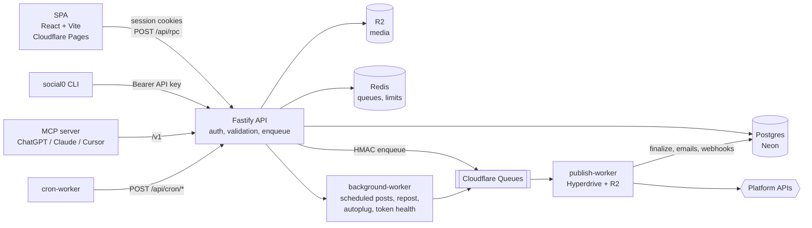

<div align="center">

# Social0

**Compose once. Publish everywhere.**

A multi-platform social scheduler with live analytics, a unified inbox, and automation built in —
one composer publishes to nine networks in parallel, and everything the dashboard can do is also
available over a REST API, a CLI, and an MCP server for AI agents.

[**social0.app**](https://social0.app) · [Docs](https://docs.social0.app) · [API reference](https://api.social0.app/openapi.json) · [MCP](https://mcp.social0.app)


</div>

---

## Highlights

- **Parallel publishing** — every selected account receives the post at the same time, and one platform failing never blocks the rest.
- **Live publish progress** — "Publish now" streams per-platform status over SSE until every target settles.
- **One calendar** — scheduled, queued, draft and published posts across all connected accounts.
- **Analytics from the source** — metrics are fetched live from each platform for posts published through Social0, never estimated.
- **Unified inbox** — comments and DMs from connected accounts, with reply, like and hide in place.
- **Teams and workspaces** — admin, member, community and analyst roles, so an analyst sees analytics and a community manager answers the inbox without publish rights.
- **Built for agents** — an API key unlocks the same surface from `curl`, the `social0` CLI, or any MCP client (ChatGPT, Claude, Cursor).
- **Encrypted at rest** — platform OAuth tokens are encrypted, never logged, and refreshed by a token-health cron.

## Supported platforms

| Platform | Connect | Publish | Analytics | Comments | DMs |
| -------- | ------- | ------- | --------- | -------- | --- |
| X (Twitter) | OAuth 1.0a | Text, images, video, threads | ✅ | ✅ | ✅ |
| LinkedIn | OAuth 2 | Profiles and company pages | ⏳ | ⏳ | — |
| Instagram | Meta OAuth | Images, video, carousels | ⏳ | ⏳ | ⏳ |
| Facebook | Meta OAuth | Pages only | ✅ | ✅ | — |
| Threads | Meta OAuth | Text, images, video | ✅ | ✅ | — |
| TikTok | Login Kit (PKCE) | Video and photo posts | ✅ | — | ⏳ |
| YouTube | Google OAuth | Videos and Shorts | ✅ | ✅ | — |
| Pinterest | Pinterest OAuth | Pins with board picker | ✅ | — | — |
| Bluesky | Handle + app password | Text, images, video | ✅ | ✅ | ✅ |

✅ live · ⏳ built, waiting on the platform's App Review · — no public API for it

Publishing works on every platform above. Read features are gated per platform in
[`live-platforms.ts`](backend/server/src/lib/live-platforms.ts), which is the single source of truth
— a flag flips the moment access is approved. [`FEATURES.md`](FEATURES.md) has the full product
surface.

## Architecture



The rule that shapes the whole system: **HTTP handlers never wait on a platform API**. A publish
request validates, writes `publish_jobs` and `post_publications`, fans out one job per platform and
returns immediately. Uploads that can take minutes (TikTok, YouTube, Meta video) run on the
Cloudflare publish worker, which finalizes the post, sends failure emails and delivers user
webhooks. Analytics and inbox reads are the deliberate exception — they hit platform APIs during the
request, under timeouts and a live-read budget.

## Repository layout

| Path | What lives there |
| ---- | ---------------- |
| [`frontend/`](frontend) | The SPA — marketing, auth, onboarding, dashboard, composer, analytics, inbox |
| [`backend/server/`](backend/server) | Fastify API: auth, validation, RPC, billing, OAuth connect, `/v1` |
| [`backend/server/src/lib/publish-platforms/`](backend/server/src/lib/publish-platforms) | One file per network — where a new platform goes |
| [`backend/background-worker/`](backend/background-worker) | Cron consumers: scheduled publish, repost, autoplug, token health |
| [`backend/shared/`](backend/shared) | Queue names, job payloads, the Cloudflare enqueue client |
| [`cloudflare/publish-worker/`](cloudflare/publish-worker) | Edge publishing with Hyperdrive and R2 |
| [`cloudflare/cron-worker/`](cloudflare/cron-worker) | Scheduled triggers that call the API's cron routes |
| [`cloudflare/mcp-worker/`](cloudflare/mcp-worker) | Hosted MCP endpoint with OAuth |
| [`social0-cli/`](social0-cli) | The public `social0` CLI |
| [`social0-mcp/`](social0-mcp) | The public `@social0/mcp` server |

The SPA and the backend are **separate packages**. Cloudflare Pages builds `frontend/` alone, so
nothing under `backend/` may be imported into it.

## Quickstart

**You'll need:** Node 20+, a Postgres database ([Neon](https://neon.tech) works well), a Redis
instance ([Upstash](https://upstash.com) free tier is enough), and Cloudflare R2 for media. Platform
OAuth apps are only needed for the networks you actually want to connect.

```bash
git clone https://github.com/Abhishek-B-R/social0-oss.git
cd social0-oss

cp backend/.env.example backend/.env
cp frontend/.env.example frontend/.env

npm run install:all   # installs frontend and backend separately, as production does
npm run dev           # API :3001, background worker, SPA :5173
```

Vite proxies `/api` and `/v1` to the API, so leave `VITE_API_URL` empty for local development.

| Command | What it does |
| ------- | ------------ |
| `npm run dev` | SPA, API and background worker together |
| `npm run dev:frontend` / `dev:server` / `dev:worker` | One piece at a time |
| `npm run build` | Build backend, then frontend |
| `npm run typecheck` | TypeScript across both trees |
| `npm run lint` | ESLint across both trees |
| `npm run db:migrate` | Apply migrations |

Scheduled posts only publish if something calls `/api/cron/*` on a schedule — in production that's
[`cloudflare/cron-worker`](cloudflare/cron-worker).

## Developer surfaces

Everything below runs on the same `/v1` API, authenticated with a key from
[Dashboard → API keys](https://social0.app/dashboard/api-keys).

```bash
# REST
curl -H "Authorization: Bearer $SOCIAL0_API_KEY" https://api.social0.app/v1/accounts

# CLI
npx social0 login
npx social0 publish --content "Launching today!" --platform twitter linkedin
npx social0 analytics
```

For AI agents, point any MCP client at `https://mcp.social0.app/mcp`, or run
[`@social0/mcp`](social0-mcp) over stdio. Agents get tools for publishing (`publish_now`,
`schedule_content`, `upload_media`), analytics (`get_analytics`, `get_post_analytics`) and the inbox
(`list_inbox_comments`, `reply_to_comment`, `list_inbox_dms`, `reply_to_dm`).

## Deployment

| Piece | Runs on |
| ----- | ------- |
| SPA | Cloudflare Pages, building `frontend/` |
| API + background worker | A VM under PM2 |
| Publish, cron and MCP workers | Cloudflare Workers, deployed with Wrangler |
| Database | Postgres (Neon), reached from the edge through Hyperdrive |
| Media | Cloudflare R2 |
| Queues and rate limits | Cloudflare Queues and Redis |

Publishing defaults to the Cloudflare worker (`PUBLISH_DISPATCH=cloudflare`) and falls back to
BullMQ on the API host. X and TikTok deliberately publish from the API process, where chunked video
upload and 64-bit permalinks are handled.

## Documentation

| Document | Covers |
| -------- | ------ |
| [`FEATURES.md`](FEATURES.md) | The complete product surface, plan by plan |
| [`CONTRIBUTING.md`](CONTRIBUTING.md) | Setup and where to make each kind of change |
| [`CLAUDE.md`](CLAUDE.md) | Architecture guide, also written for AI coding agents |
| [`backend/README.md`](backend/README.md) | API and worker internals |
| [`frontend/README.md`](frontend/README.md) | SPA structure, routing and theming |
| [`cloudflare/publish-worker/README.md`](cloudflare/publish-worker/README.md) | Edge publishing and its bindings |
| [`docs/`](docs) | Platform permissions and analytics scopes |

## Contributing

Issues and pull requests are welcome. [`CONTRIBUTING.md`](CONTRIBUTING.md) explains the setup and
points you at the right directory for each kind of change; adding a network, for instance, is a new
file under `backend/server/src/lib/publish-platforms/`. Please run `npm run typecheck` and
`npm run lint` before opening a PR.

One thing to know about this repository: it is published from the repository that runs
[social0.app](https://social0.app), and every release overwrites it. Accepted pull requests are
applied upstream and arrive here on the next publish, so your PR may be closed as applied rather
than merged, and commits pushed straight to this repository do not survive.

## License

[AGPL-3.0](LICENSE). The `social0-cli` and `social0-mcp` packages are MIT, so anyone can build
clients against the API freely.
